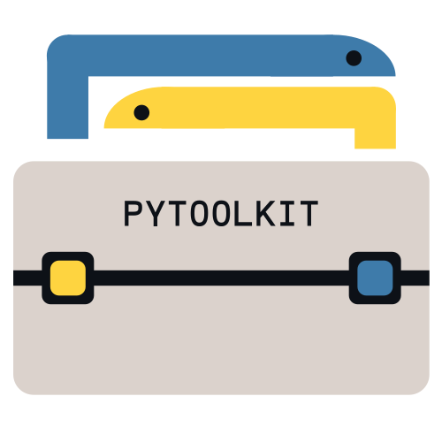

# Pytoolkit (Open-Python-CLI-Tools)


<code>pytoolkit-leomb</code> is collection of simple Python CLI utilities designed to simplify everyday tasks.
Built with Typer, Pathlib, and Rich, it provides a lightweight and extensible way to manage small command-line tools in one place.<br>



## Installation
Because **pytoolkit-leomb** is a CLI tool, we recommend installing it with **pipx**, as it keeps the tool isolated from your system Python while still allowing you to run pytoolkit from anywhere in your terminal.
### On Linux system:
```
sudo apt install pipx
pipx ensurepath
```
### On Windows system:
```
py -m pip install --user pipx
pipx ensurepath
```
#### After that, you can install your CLI tool the same way:
```
pipx install pytoolkit-leomb
```
Or in development mode (you need to be inside the project folder):
```
pip install --editable .
```
